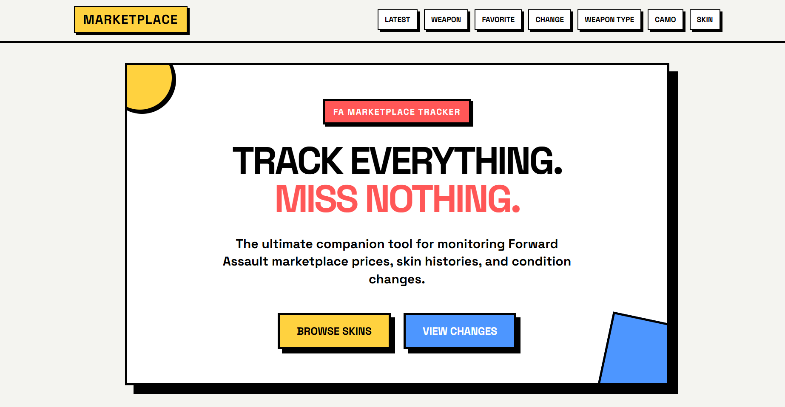
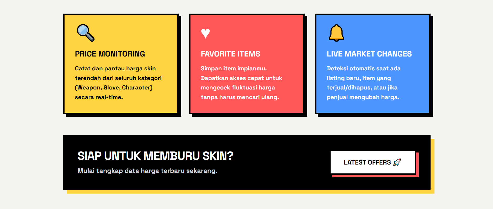
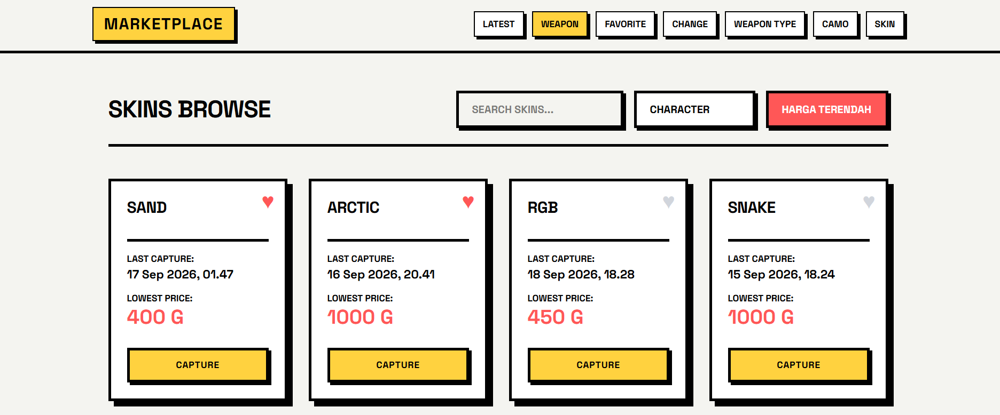
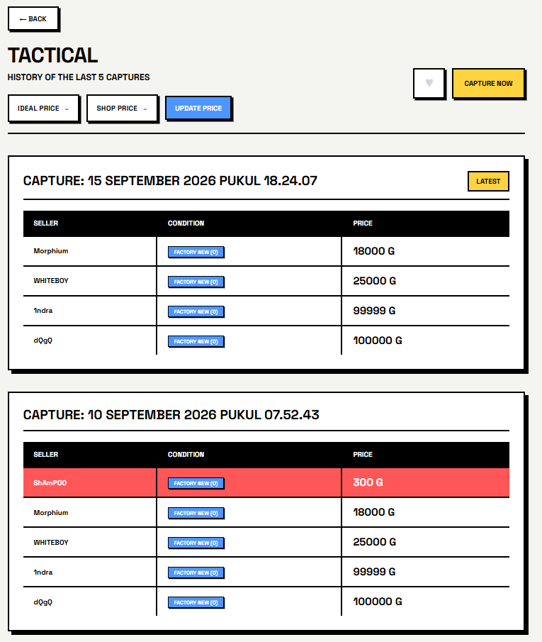
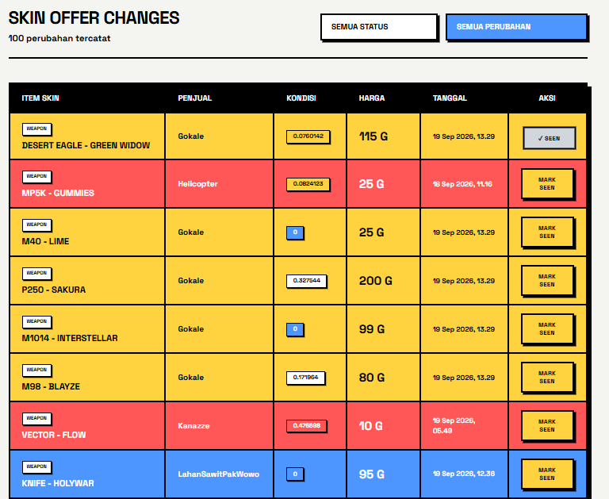

# FA Marketplace Tracker

FA Marketplace Tracker is an application for monitoring the Forward Assault marketplace. It helps users view skin prices, save favorite items, record capture history, and track marketplace listing changes.

# OVERVIEW



The home page provides navigation to marketplace categories such as latest offers, weapons, favorites, changes, weapon types, camos, and skins. From this page, users can quickly access the skins or marketplace changes they want to monitor.



The feature overview highlights the application's three main functions: monitoring the lowest skin prices in real time, saving favorite items for quick access, and detecting listing changes such as new items, sold items, removed items, or price changes.

# FEATURES



The browse page displays a list of skins by category. Users can search for skins, filter by category, view the latest capture time, check the lowest price, and run a capture to retrieve the latest marketplace data.



The skin detail page displays previous capture history. Each capture includes the seller, item condition, and price, allowing users to compare price changes over time. Items can also be marked as favorites and their prices can be updated.



The skin offer changes page summarizes changes occurring in the marketplace. Users can filter by status or change type, view the item, seller, condition, price, and change time, and mark changes as seen.

# CLONE & RUN

Clone the repository:

```bash
git clone <url-repository>
cd <folder-name>
```

Install the dependencies:

```bash
npm install
```

Copy `.env.example` to `.env`, then fill in the required configuration.

Run the application:

```bash
npm run dev
```

The application will be available at `http://localhost:3000`.
